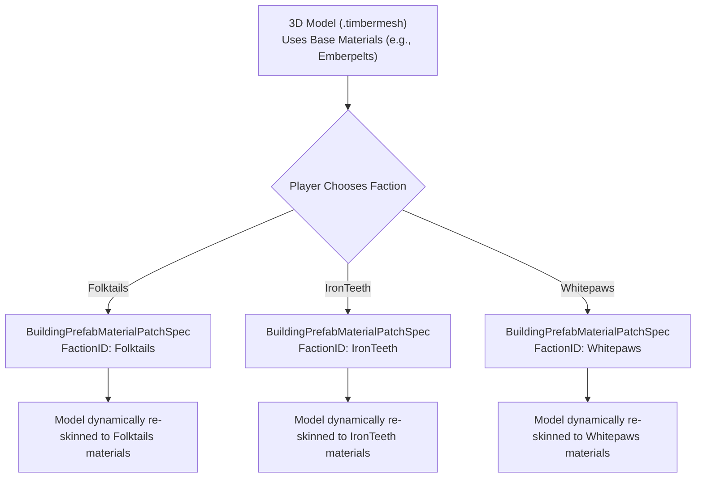

# Timberborn Material Patcher & Custom Specifications Wiki

Comprehensive technical reference guide for Timberborn's **Material Patcher**, **Character Customizer**, and **Custom Specifications** framework (Bobingabout Script Pack / `version-1.1`).

---

## 📋 Table of Contents

1. [Overview & Core Architecture](#overview--core-architecture)
2. [Building Prefab & Faction Material Patching](#building-prefab--faction-material-patching)
3. [Material Patcher Specification Reference](#material-patcher-specification-reference)
   - [BuildingPrefabMaterialPatchSpec](#1-buildingprefabmaterialpatchspec)
   - [MaterialPatchSpec](#2-materialpatchspec)
   - [ShaderPatchSpec](#3-shaderpatchspec)
   - [WaterShaderPatchSpec](#4-watershaderpatchspec)
   - [LiquidGoodMaterialPatchSpec](#5-liquidgoodmaterialpatchspec)
   - [LiquidGoodMaterialCloneSpec](#6-liquidgoodmaterialclonespec)
   - [MaterialCloneSpec](#7-materialclonespec)
4. [Character Customizer Specification Reference](#character-customizer-specification-reference)
   - [BotTexturesSpecification](#1-bottexturesspecification)
   - [BeaverGrowUpTextureMapSpecification](#2-beavergrowuptexturemapspecification)
   - [CharacterAvatarMapSpecification](#3-characteravatarmapspecification)
   - [CustomBeaverByNameSpecification](#4-custombeaverbynamespecification)
5. [Building Scripts & DLL Extensions](#building-scripts--dll-extensions)
6. [Best Practices & Troubleshooting](#best-practices--troubleshooting)

---

## 🌟 Overview & Core Architecture

The **Material Patcher** framework provides a specification-driven architecture that allows modders to dynamically alter building materials, shaders, beaver textures, and bot visuals per faction without recompiling C# code.

### Key Capabilities:
- **Dynamic Faction Skinning**: Swap base model materials (`Emberpelts`, `Folktails`, `IronTeeth`, `Whitepaws`) depending on which faction the player chooses.
- **Shader & Transparency Fixes**: Resolve broken Unity shaders on pile storage planes and liquid surfaces.
- **Character Customization**: Assign custom textures to bots, preserve child-to-adult fur colors, and customize named beavers.

---

## 🎨 Building Prefab & Faction Material Patching

### The Base Model + Faction Patch Pattern

When creating 3D models (`.timbermesh`) for multi-faction mods, the standard practice is to build the 3D model using a primary base material (such as `*.Emberpelts` or `*.Folktails`).

When the game runs, the **Material Patcher** intercepts the building prefab during initialization on `Start()` and checks for a `BuildingPrefabMaterialPatchSpec` matching the active `FactionID`. It replaces the original model materials with the selected faction's materials.



---

## 🛠️ Material Patcher Specification Reference

### 1. `BuildingPrefabMaterialPatchSpec`

Replaces specific materials on a building prefab with target materials when a specific faction is played.

#### JSON Schema:
```json
{
  "BuildingPrefabMaterialPatchSpec": {
    "FactionID": "Folktails",
    "PrefabName": "DoubleFloodgate.Flat.Folktails",
    "MaterialEntries": [
      {
        "MaterialName": "BaseWood_Brown.Emberpelts",
        "NewMaterialName": "BaseWood_Brown.Folktails"
      },
      {
        "MaterialName": "PaintedMetal.Emberpelts",
        "NewMaterialName": "PaintedMetal.Folktails"
      }
    ]
  }
}
```

#### Fields:
- `FactionID` (*string*): The target faction that triggers this patch (`Folktails`, `IronTeeth`, `Whitepaws`, `Emberpelts`, etc.).
- `PrefabName` (*string*): The exact prefab identifier of the building (e.g., `Floodgate.Flat.IronTeeth`).
- `MaterialEntries` (*array*):
  - `MaterialName` (*string*): The original material assigned to the `.timbermesh` or Unity asset.
  - `NewMaterialName` (*string*): The replacement material to apply for this faction.

#### Important Notes & Limitations:
- Executed in `Start()` post-processing.
- **Color Tints**: Color tints on original materials do not carry over automatically.
- **Atlased Materials**: Vanilla materials bound to shared texture atlases cannot be replaced individually via this spec.

---

### 2. `MaterialPatchSpec`

Modifies individual material properties (textures, colors, numeric shader values) for a specific faction.

#### JSON Schema:
```json
{
  "MaterialPatchSpec": {
    "FactionID": "Emberpelts",
    "MaterialName": "BlueberryBush",
    "TextureEntries": [
      { 
        "Name": "_MainTex", 
        "Path": "Materials/UberAtlas/Textures/Emberpelts/Blueberry_D.Emberpelts" 
      }
    ],
    "ColorEntries": [
      { 
        "Name": "_Color", 
        "Colour": "0.8, 0.1, 0.1, 1.0" 
      }
    ],
    "NumberEntries": [
      {
        "Name": "_Glossiness",
        "Value": 0.5
      }
    ]
  }
}
```

---

### 3. `ShaderPatchSpec`

Fixes broken or invisible shaders on modded 3D models (such as pile storage planes) by copying shaders from a donor material.

#### JSON Schema:
```json
{
  "ShaderPatchSpec": {
    "FactionID": "Emberpelts",
    "DonorName": "DirtPile",
    "MaterialNames": [ "ClayPile", "CoalPile" ]
  }
}
```

---

### 4. `WaterShaderPatchSpec`

Specifically designed for water/liquid planes. Copies donor water shaders while making the edge foam layer transparent to prevent visual artifacts on custom liquids.

#### JSON Schema:
```json
{
  "WaterShaderPatchSpec": {
    "FactionID": "Emberpelts",
    "DonorName": "Water",
    "MaterialNames": [ "AppleJuice", "TomatoJuice", "RedJuice" ]
  }
}
```

---

### 5. `LiquidGoodMaterialPatchSpec`

Duplicates a donor liquid material (e.g., `Water`) and applies the target liquid good's properties for display inside liquid storage tanks.

#### JSON Schema:
```json
{
  "LiquidGoodMaterialPatchSpec": {
    "FactionID": "Emberpelts",
    "DonorMaterialName": "Water",
    "GoodNames": [ "AppleJuice", "TomatoJuice", "RedJuice", "CornJuice" ]
  }
}
```

---

### 6. `LiquidGoodMaterialCloneSpec`

Clones an existing liquid material and allows custom texture, color, and numeric overrides for liquid goods in storage tanks.

#### JSON Schema:
```json
{
  "LiquidGoodMaterialCloneSpec": {
    "FactionID": "Emberpelts",
    "GoodName": "TomatoJuice",
    "DonorMaterialName": "Coffee",
    "TextureEntries": [
      { "Name": "_MainTex", "Path": "Materials/Goods/Textures/TomatoJuice" }
    ],
    "ColorEntries": [
      { "Name": "_Color", "Colour": "0.7, 0.7, 0.7, 1.0" },
      { "Name": "_FoamColor", "Colour": "0.8, 0.2, 0.1, 1.0" }
    ],
    "NumberEntries": []
  }
}
```

---

### 7. `MaterialCloneSpec`

Clones an existing material under a new material name with optional texture/color property overrides.

#### JSON Schema:
```json
{
  "MaterialCloneSpec": {
    "FactionID": "Whitepaws",
    "MaterialName": "BaseWood_White.Folktails",
    "NewMaterialName": "Pink_wood.Whitepaws",
    "TextureEntries": [],
    "ColorEntries": [
      { "Name": "_Color", "Colour": "1.0, 0.75, 0.8, 1.0" }
    ],
    "NumberEntries": []
  }
}
```

---

## 🦫 Character Customizer Specification Reference

### 1. `BotTexturesSpecification`

Assigns a random selection of bot textures per faction upon bot creation.

```json
{
  "FactionID": "Emberpelts",
  "BotTextures": [
    "Materials/Bots/Emberpelts/Bot1.Emberpelts",
    "Materials/Bots/Emberpelts/Bot2.Emberpelts",
    "Materials/Bots/Emberpelts/Bot3.Emberpelts"
  ]
}
```

---

### 2. `BeaverGrowUpTextureMapSpecification`

Maps child beaver textures to specific adult textures upon growing up, preserving fur colors across growth stages.

```json
{
  "TextureMaps": [
    {
      "ChildTextureName": "BeaverChild1.Emberpelts",
      "AdultTextureNames": [ "BeaverAdult5.Emberpelts" ]
    },
    {
      "ChildTextureName": "BeaverChild6.Emberpelts",
      "AdultTextureNames": [ "BeaverAdult6.Emberpelts", "BeaverAdult7.Emberpelts" ]
    }
  ]
}
```

---

### 3. `CharacterAvatarMapSpecification`

Maps custom beaver textures to UI icons (avatars) for adult, child, and contaminated states.

```json
{
  "AvatarMaps": [
    {
      "TextureName": "BeaverAdult1.Folktails",
      "AvatarPath": "Sprites/Avatars/FolktailsAdult",
      "ContaminatedAvatarPath": "Sprites/Avatars/FolktailsContaminatedAdult"
    }
  ]
}
```

---

### 4. `CustomBeaverByNameSpecification`

Defines unique beaver appearance sets tied to specific names in the game.

```json
{
  "Name": "Jimbo",
  "ExcludeFromNamePool": "True",
  "Texture": "CustomBeavers/Textures/BeaverAdult.Gold",
  "ChildTexture": "CustomBeavers/Textures/BeaverChild.Gold",
  "Avatar": "CustomBeavers/Avatars/GoldAdult",
  "ChildAvatar": "CustomBeavers/Avatars/GoldChild"
}
```

---

## ⚙️ Building Scripts & DLL Extensions

The script pack includes three specialized C# assemblies:

1. **`Bobingabout.Misc.dll`**:
   - `AnimationController`: Plays a loop animation continuously without workplace/power requirements.
2. **`Bobingabout.StockpileVisualizer.dll`**:
   - `BobingaboutStockpileVisualizerGoodPileSpec`: Dynamically calculates height and column bounds for visual storage items in warehouses/piles.
3. **`Bobingabout.AutomatedManufactory.dll`**:
   - `AutomatedManufactoryPowerConsumptionSwitch`: Toggles power consumption off when automated buildings (e.g., automated water pumps) pause work, without requiring beaver workers.
   - `AutomatedManufactoryAnimationController`: Suspends building animations when production recipes are blocked or idle.

---

## ✅ Best Practices & Troubleshooting

1. **File Naming Convention**: Always name specification files with a unique suffix:
   - `BuildingPrefabMaterialPatch.FactionName.BuildingName.blueprint.json`
   - `BotTexturesSpecification.FactionName.json`
2. **Case Sensitivity**: `FactionID` and `PrefabName` must match game identifiers exactly.
3. **Relative File Paths**: Texture paths inside specifications must use forward slashes `/` relative to the mod's root folder.
